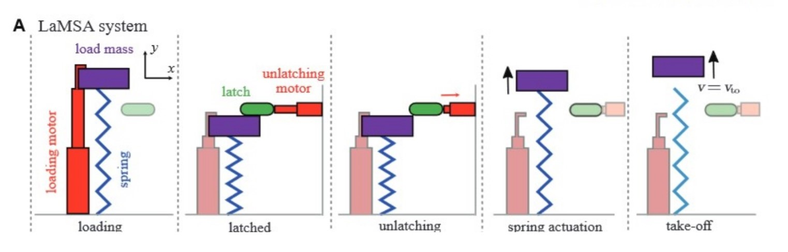

# Muscle Modeling Primer

### Basics
Muscle models are intrinsically difficult to verify because of the practical difficulty of getting muscles to perform how they typically would in conditions where it is easy to measure their properties. To get a sense of where the field of muscle mechanics stands, read [Nishikawa et al SICB 2018](https://drive.google.com/file/d/1J6hNHWgol3XgY8FOeU45y29ljOrWOW2b/view?usp=sharing). Focus on information about force-length relationships, titin, and stretch. You don’t need to know much about cross-bridge models, as we don’t focus on neuromuscular systems. 

In a lot of muscle mechanics literature, you see references to OpenSim, which is useful for looking at large musculoskeletal systems, specifically humans. While I wouldn’t recommend going to the trouble of downloading it unless you plan to construct a new musculoskeletal model or have a specific model to work with, its muscle modelling methods are widely accepted. Skim [Millard et al ASME 2013](https://drive.google.com/file/d/1y5CJJ-qYJhhKfPMGGYU025OqLAb6s4x4/view?usp=sharing) and see some other ways people go about modeling muscles, though it's fairly different from any of ours.  [Thelen ASME 2013](https://drive.google.com/file/d/1P7f6-phYuhpiZ6_2U_tazHxfViYWgDnz/view?usp=sharing) is worth reading to see a different way for utilizing the Hill model . Draw the force-length relationship graph, force-velocity relationship graph, and labeled muscle diagram from this paper.

### Within the LaMSA Model

In the LaMSA model GUI you’ll see unlatching and loading motors. As you can see below, the loading motor compresses the spring and the unlatching motor either yanks the latch out of the way or holds the latch in place until it’s ready to unlatch (deactivating motor).

If you generate some 1D and 2D plots, you’ll also notice that the LaMSA plot is contrasted with direct actuation. Direct actuation shows what would happen if the mass was propelled by the loading motor instead of the spring.

Let’s now look at each of the motors. Generate a few plots with each, look at their code, draw the muscle they represent (like the diagram from Thelen), and write a good circumstance to use them. For loading motors you have: LinearMotor, HillMuscleMotor, and TwoPartMuscle muscle. 

   

   ### LinearMotor
   
   

The LinearMotor simply reflects a linear force-length relationship. 

 

The DeativatingMotor extends instead of contracting, exerting force in the opposite direction of the others. This makes it useful as an unlatching motor, but not a loading motor.

The HillMuscleMotor incorporates a hill muscle model from [Rosario et al RSPB 2016](https://drive.google.com/file/d/1hQZRgUJSEeX45XuyvUjl70zC1H38Xo8d/view?usp=sharing) Read the paper and draw the muscle model, force-length, force-velocity, and force-activation curves that you see. Note suitability of this model to modeling elastic systems.

The TwoPartMuscleMotor incorporates a version of the hill muscle model with a contractile and parallel elastic element. It also uses different constants and equations to model motion, so it’s more flexible. Read the paper it’s based on, [Hauefle et al JEB 2014](https://drive.google.com/file/d/1FPZSl_6uO3dHY5OEQ8Jqka2fGD2D--AG/view?usp=sharing), and draw the muscle element diagram as well as the force length curve with and without the parallel elastic element engaged.
    
### Next Steps

TwoPartMuscleMotor is fairly new and could be further fine tuned. Additionally, it’s capability for eccentric contraction could make it useful as a deactivating motor, though whether that is needed to model anything is unclear. The large number of constants in the constructor, which shape the force-length and force-velocity relationship curves, could be fine-tuned to reflect other types of muscle (currently they reflect mammalian slow-twitch muscle).

Generally, the existing muscle models could all stand to be further verified, whether using a muscle-modeling software or checked against experimental data. 

Also, it could be useful to set up a kinematics tab to model direct actuation as well as LaMSA, to study muscle mechanics or verify new muscle motors.
