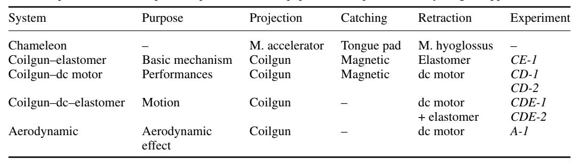
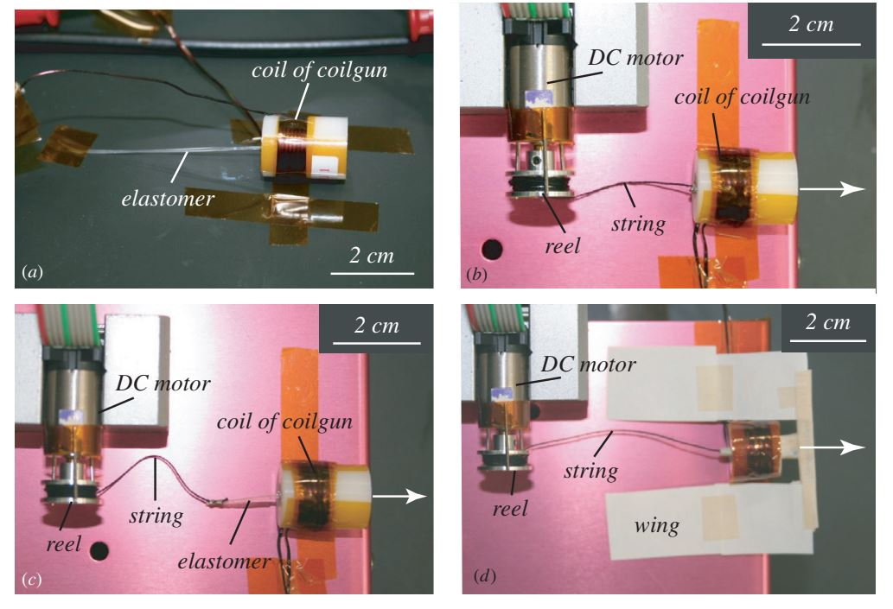
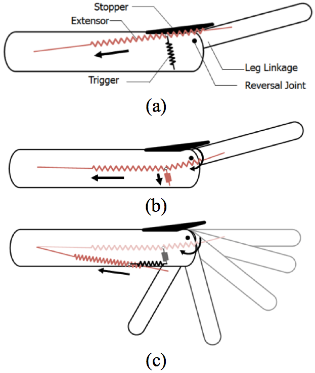
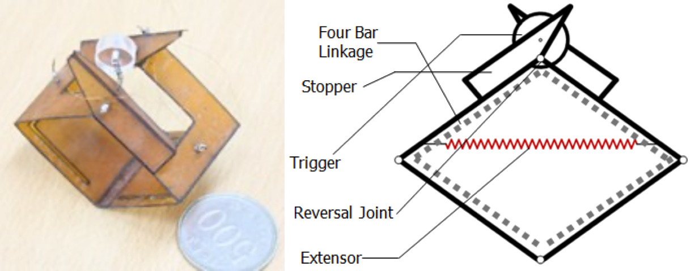
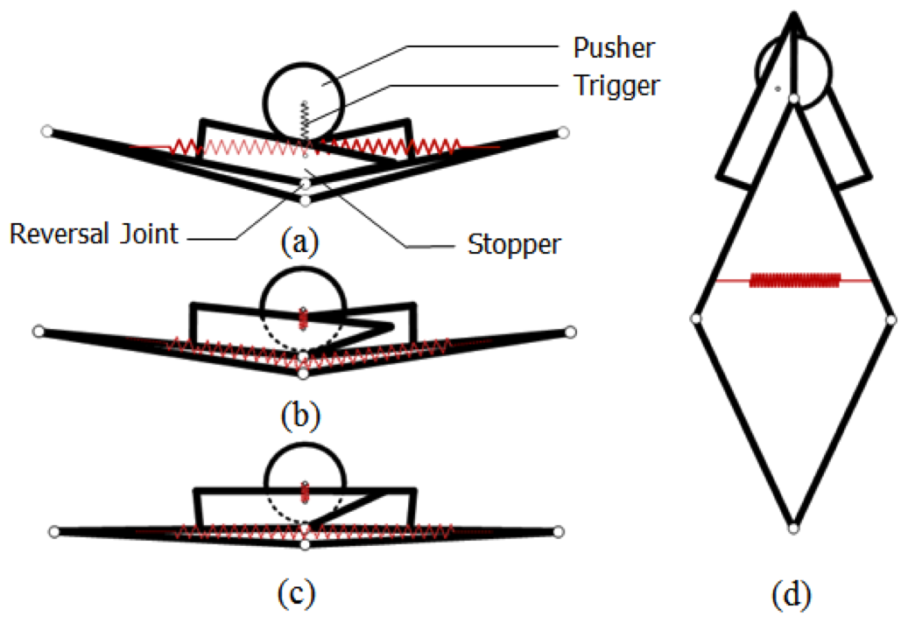
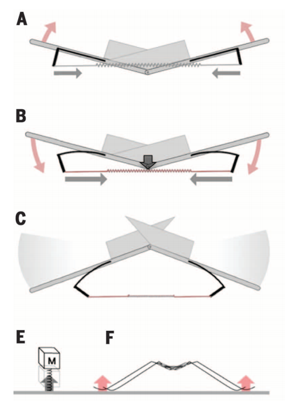
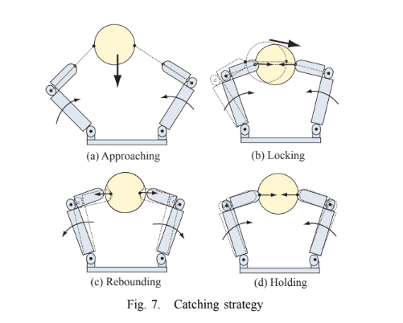
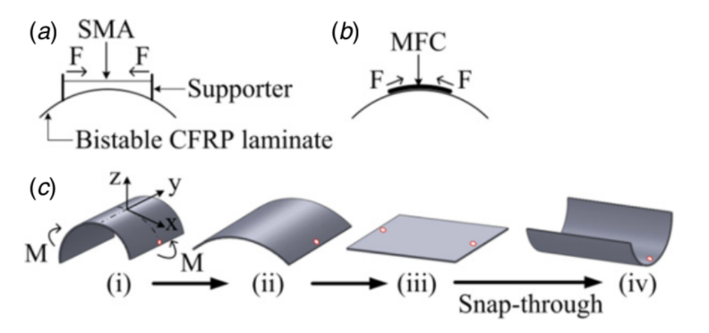
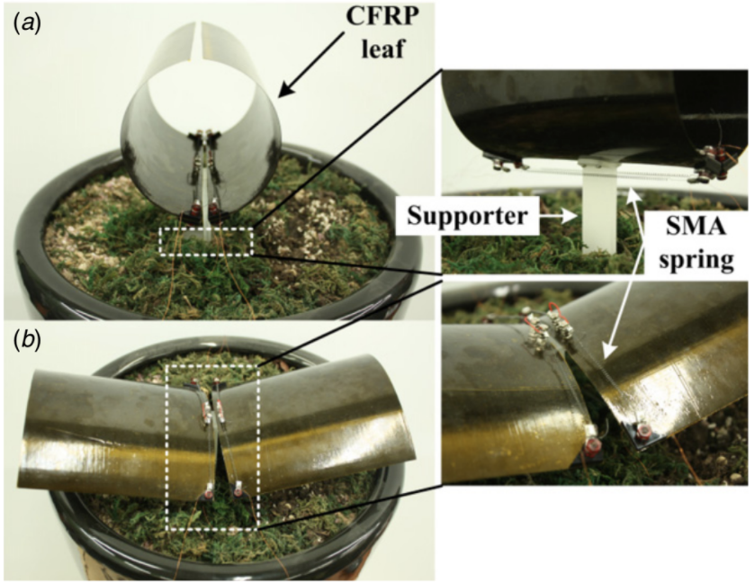
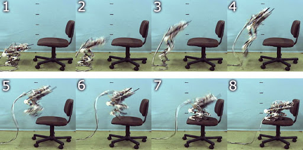

# Bioinspired Microrobotic Devices

Using nature as inspiration, recent work in robotics has taken principles of design from some ultra-fast movements in nature. This page includes examples of engineered systems that (often) use the storage and quick release of elastic energy to drive movement.

To contribute to this page, choose a device from the list below and add information. Some starting references are provided as Google Drive links in each section. If you find other research papers, be sure to save them to the posmlab Google Drive "Papers" folder and link to them here. The organisms listed are from Table 1 of [Ilton et al Science 2018](https://drive.google.com/open?id=1uo5F2MfkcKfCjjJiLNwWVN3OzWN_OLh7), but add other examples here if you come across them.

[Micro elastomer jumper](#micro-elastomer-jumper)

[Energetic silicon jumper](#energetic-silicon-jumper)

[Chameleon tongue-inspired system](#chameleon-tongue-inspired-system)

[Flea-inspired robot](#flea-inspired-robot)

[Steerable MSU jumper](#steerable-msu-jumper)

[Water strider-inspired robot](#water-strider-inspired-robot)

[EPFL 7 g robot](#epfl-7-g-robot)

[JPL hopper](#jpl-hopper)

[High-speed fingered hand](#high-speed-fingered-hand)

[Locust-inspired robot](#locust-inspired-robot)

[Flytrap-inspired robot](#flytrap-inspired-robot)

[Galago-inspired Salto robot](#galago-inspired-salto-robot)

[Sand flea-inspired robot](#sand-flea-inspired-robot)

[Sandia Mars hopper](#sandia-mars-hopper)

[Soft combustion robot](#soft-combustion-robot)

[Bipedal jumper Mowgli](#bipedal-jumper-mowgli)

----------------------------

### Micro elastomer jumper
[Gerratt and Bergbreiter Smart Mater Struct 2013](https://drive.google.com/open?id=1lLtdhQMT8jIQa2Tt-brgbHMaO9Imt2zi)

### Energetic silicon jumper
[Churaman et al J Microelectromech Syst 2012](https://drive.google.com/open?id=1Oy4LIYb04gKtzj8Dq-sJMZs0Hqa1iC1O)

### Chameleon tongue-inspired system 

This system takes inspiration from the capability of the chameleon tongue to project to more than 6 times its rest length, the flexibility of the moving element, and the lack of continuous force during the forward motion. THe system consists of 4 separate manipulators, each mimicking different aspects of the cameleon tongue system, moving towards completely mimicking the system (as close as it is possible to get without biological methods). 

The common elements the 4 engineering manipulators are as follows:
> + extend as they move
> + flexible moving element
> + no continuous applied force

The first manipulator reproduces the basics of the tongue system. The second manipulator extends the mechanical capabilites of the first, and attempts to more closely reproduce the mechanical specifications of nature. The third attempts to better reproduce the motion of the chameleon tongue, mimicking the motion as a function of time. Finally, the fourth went beyond the chameleon tongue model, including wings to take advantage of aerodynamics. The ability to project and retract was thus implemented slightly differently in each manipulator.

##### Table 1 from Debray describes how the four manipulators were implemented mechanically, and how that relates to the same function in the chameleon model.

##### Figure 3 from Debray shows photographs of the four manipulators dicussed. (a) coilgun elastomer system (b) coilgun-dc motor system (c) coilgun-dc-elastomer system (d) aerodynamic system.

Future improvements on the existing models include:
> + studying performance of catching as a function of aiming direction
> + incoorporating an active catching device, similar to what is present in the chameleon tongue and allows for capture of heavier prey
> + incoorporating the wings in controlling direction during motion
> + sensors being integrated for real-time position monitoring

This device has great potential applications, specifically in factory lines. The extensibility is limited by the rigidity of the arm, but as the arm is designed to extend, many positions can be reached without the system occupying much volume. The flexibility of the moving element reduces the impact of collisions, as does the lack of a continuous force being applied such as with a robotic arm. 

[Debray Bioinspir Biomim 2011](https://drive.google.com/open?id=1Xv6ejFxYzqn1a_La159wmyE9qjkg3uG_)

### Flea-inspired robot

Fleas have special mechanisms within their legs that act like catapults, storing and releasing elastic energy to propel the fleas into the air. Using its legs, a 1 mm flea can jump 150 mm into the air, which is 150 times its body length! In a flea's leg, energy is stored in an elastic material called resilin and in the extensor muscle [[1]](https://drive.google.com/open?id=1lA-ZneFo5w-ecYH2pIVgz0naCB40lueS). First, the extensor muscle pulls on part of the leg and builds up elastic potential energy (Figure 1a). At this point, the leg is prevented from rotating in the direction of the torque. Next, a trigger muscle pulls on the extensor muscle, which reverses the direction of torque in the leg (Figure 1b). Since the leg is free to rotate in the other direction, there is a sudden release of the elastic potential energy (Figure 1c).

 
__Figure 1__: *A schematic diagram of torque reversal mechanics, with the specific details of the flea leg abstracted away.* [[1]](https://drive.google.com/open?id=1lA-ZneFo5w-ecYH2pIVgz0naCB40lueS)

Using the flea's torque reversal principle, Koh et al. designed a 30 mm robot which can jump 120 cm into the air [[1]](https://drive.google.com/open?id=1lA-ZneFo5w-ecYH2pIVgz0naCB40lueS). This robot has a similar design to the more recent [water strider-inspired robot](#water-strider-inspired-robot), which was also designed by Koh et al. The design, shown in Figure 2, is simpler than previous flea-inspired robots, which were designed to more closely mimic the overall structure and appearance of a flea. In contrast, the model designed by Koh et al. is simpler while still capturing the essential torque reversal mechanics. The new model (Figure 2) can be constructed from a single sheet of material and requires fewer adhesive bonds, which reduces the risk of misalignment [[1]](https://drive.google.com/open?id=1lA-ZneFo5w-ecYH2pIVgz0naCB40lueS).

 
__Figure 2__: *Image and diagram of the simplified flea-inspired jumping robot.* [[1]](https://drive.google.com/open?id=1lA-ZneFo5w-ecYH2pIVgz0naCB40lueS)

Unlike most miniature robots which use an elastic catapult mechanism, the flea-inspired model from Koh et al. uses an "active" method of storing elastic potential energy [[1]](https://drive.google.com/open?id=1lA-ZneFo5w-ecYH2pIVgz0naCB40lueS). In passive storage methods, elastic energy is stored by deforming a material, whereas active storage methods work by increasing the stiffness of a material [[1]](https://drive.google.com/open?id=1lA-ZneFo5w-ecYH2pIVgz0naCB40lueS). The active method requires a variable-stiffness  element, made of a material in which the stiffness can be increased by another source of energy, such as thermal or electrical [[1]](https://drive.google.com/open?id=1lA-ZneFo5w-ecYH2pIVgz0naCB40lueS). Koh et al. used a shape-memory-alloy coil spring as the variable-stiffness element [[1]](https://drive.google.com/open?id=1lA-ZneFo5w-ecYH2pIVgz0naCB40lueS). (This video has more information about how a shape memory alloy works and some cool applications: [https://youtu.be/wI-qAxKJoSU](https://youtu.be/wI-qAxKJoSU).) Using an active storage method was essential in building up elastic potential energy in such a small robot.

Figure 3 shows the method by which the flea-inspired robot uses torque reversal mechanics to jump. In the pre-jump state (Figure 3a), the robot builds up elastic potential energy by increasing the heat in the spring via electic current. The trigger then pulls on the circular pusher (Figure 3b), which moves the extensor through the reversal joint (Figure 3c), triggering the jump (Figure 3d).

 
__Figure 3__: *Schematic of the jumping procedure of the flea-inspired robot.* [[1]](https://drive.google.com/open?id=1lA-ZneFo5w-ecYH2pIVgz0naCB40lueS)

#### Summary of Kinematic Performance

| Kinematic Metric | Flea-Inspired Robot Performance [[1]](https://drive.google.com/open?id=1lA-ZneFo5w-ecYH2pIVgz0naCB40lueS) |
| -------- | ------- |
| Jump Velocity | 7 m/s |
| Jump Height | 120 cm |
| Initial Kinetic Energy | 0.055 J |
| Conversion Efficiency | 82% |

The data above is for a 30 mm long flea-inspired robot prototype that weighs 2.25 g [[1]](https://drive.google.com/open?id=1lA-ZneFo5w-ecYH2pIVgz0naCB40lueS). The conversion efficiency compares the initial kinetic energy at takeoff to the elastic potential energy right before takeoff.

#### Sources
[1] [Koh et al IEEE 2013](https://drive.google.com/open?id=1lA-ZneFo5w-ecYH2pIVgz0naCB40lueS)

### Steerable MSU jumper 
[Zhao et al IEE Trans Robot 2013](https://drive.google.com/open?id=1SuD1m8c1r9tTVZf9lBW2tahWxfTb56k3)

### Water strider-inspired robot 
While mostly known for their ability to skate across the surface of ponds and lakes, water striders are also extremely capable jumpers both on water and land. While several robots have been designed to mimic their skating ability, [Koh et al](https://drive.google.com/open?id=199GLhP84E0Q2wsT6UpgleDHqnFasI4Tx) designed a robot using a similar mechanism to that of a flea's leg to try and achieve a design that would allow for similar jumping capabilities on the surface of the water. Using a coil and two L-shaped cantilevers, they came up with a design that would allow the torque from the coil to reverse if an outside force could bring the device past the singularity of the center joint, and cause the jumping motion:

##### Kinematics Data from Koh et al Water Strider Robot

| Kinematic Metric | Water Strider Robot performance |
| -------- | ------- |
| Jump Velocity | 1.6 m/s |
| Jump Height | 142 mm | 

[Koh et al Science 2015](https://drive.google.com/open?id=199GLhP84E0Q2wsT6UpgleDHqnFasI4Tx)

### EPFL 7 g robot 

The 7g jumping robot is capable of overcoming obstacles of around 1.4 m tall and is made to accomodate different payloads. The system has a total mass of 10 g and takes off at a 75 degree angle. To optimize the efficiency of the energy transmission from the legs, a four bar linkage design is used. In addition, this design also allows for adjustments in the take-off angle and acceleration time. Based on the mechanical properties of small jumping animals, energy is stored slowly by a DC motor into two springs connected to the legs and body and is released by a click mechanism.

Image of 7g Jumping Robot from
[Kovac et al IEEE 2008](https://drive.google.com/open?id=13YTO5TTnOkXzwpymIFafRse-I0hbXCDk)

##### Figure 5 from Kovac et al. The CAD model of the jumping mechanism.

##### Summary of Kinematic Peformance from Kovac et al

| Kinematic Metric | 7g Jumping Robot performance |
| -------- | ------- |
| Duration (Jump) | 1.02 s |
| Duration (Acceleration) | 15 ms | 
| Max. Velocity | 5.96 m/s |

 For further reading, [Kovac et al IEEE 2008](https://drive.google.com/open?id=13YTO5TTnOkXzwpymIFafRse-I0hbXCDk) has more details about the 7g jumping robot.

### JPL hopper
[Burdick and Fiorini Int J Robot Res 2003](https://drive.google.com/open?id=1RDAN-QERuIzK9G48AAmUMkePTsg68OTL)

### High-speed fingered hand

In the past, robots mimicking the human hand have been more focused on accuracy than speed. However, an actual human hand is more dextrous and flexible than a robotic hand because contact between fingers and the target changes dynamically. This robot makes use of high-speed vision to increase not only the accuracy, but also the speed of the "catching" mechanism.

The aim of this device was to maximize speed, acceleration, and accuracy while minimizing the weight of the device. It was determined from experimental results that 180 deg/0.1 s was sufficient speed for dynamic motion. To minimize the size of the device, only 3 fingers were used, which is sufficient for stable control. The hand has 8 total degrees of freedom, which allows it to grasp objects of various shapes. An actuator that allows high current flow in a short period of time enabled the high accelerations.

The active catching strategy has 4 phases: the approaching phase, the locking phase, the rebounding phase, and the holding phase. This strategy allows the arm to catch objects falling at a higher speed than the maximum speed of the arm.

##### Figure 7 from Namiki et al. The strategy of the catching mechanism.

| Kinematic Metric | Hand Robot Performance |
| -------- | ------- |
| Joint Closing Speed | 180 deg/0.1 s |
| Finger output force | 28 N | 
| Degrees of Freedom | 8 |

For further reading: [Namiki et al IEEE 2003](https://drive.google.com/open?id=10x_SWtJawHzpsDgerjedE_YeRe9PFubD)

### Locust-inspired robot
[Zaitsev et al Bioinspir Biomim 2015](https://drive.google.com/open?id=1fTxzcXYomh5jkyz-gF_PDHIlgxKalwWC)

### Flytrap-inspired robot
[Kim et al Bioinspir Biomim 2014](https://drive.google.com/open?id=13-rasGR4xlGQ_rDX6gAwDK3ehuEcGWgo)

The leaves of venus flytraps are known to have bistable properties, which means it has two stable states (see [here](https://posmlab.github.io/getting-started/organisms.html#venus-fly-trap) for more details), and researchers have used this property to create a robot that has a similar closing mechanism. The robot, pictured below, uses asymmetrically laminated sheets of carbon fiber and resin as its "leaves," which has bistability similar to that of the venus flytrap.

The bistability of the sheets allow them to snap between the "open" and "close" states, just like how the leaves of the venus flytrap does. To activate the snap, an actuator pushes on the base of the sheets, causing the sheet to snap into its other stable, closed configuration (see below).

The "open" state has a larger radius of curvature (less curved) to make it relatively easy to snap closed. In contrast, the "closed" state has a smaller radius of curvature (more curved) to make the snapping process faster.

Further reading about similar robots can be found here: [Zhang et al Composite Structures 2016](https://drive.google.com/open?id=1sHbkTDbW7V9JykRgHzV5Q0DUBi8dCt3L)

### Galago-inspired Salto robot
[Haldane et al Sci Robot 2016](https://drive.google.com/open?id=1wXFkodmrF1W6-VN_5c5PPKGcimqS5GeJ)

### Sand flea-inspired robot
[Boston Dynamics legacy product](https://www.youtube.com/watch?v=6b4ZZQkcNEo)

### Sandia Mars hopper
[Weiss Sci News 2001](https://drive.google.com/open?id=1Kbf9YQMrja2S2vOF0P3kuah-KQe3au7Y)

[Sandia Lab News](https://www.sandia.gov/LabNews/LN05-19-00/software_story.html)

### Soft combustion robot 
Many engineered robots are made from hard materials, because rigid materials are easy to predict and control. However, engineers inspired by biological systems have begun to explore designing and manufacturing systems with soft bodies. In this robot, both rigid and soft materials are used to create a robot that can jump by combusting butane and oxygen. 

[Bartlett Science 2015](https://drive.google.com/open?id=1I_E8SdiUy-zPiZ4Tt8aURbBA9AXHFX1q)

### Bipedal jumper “Mowgli”

Mowgli is a motor-controlled biped robot designed for jumping and landing. Mowgli was designed to better understand how to control explosive movements, which consist of actions with large instantaneous forces and short durations of time. In humans, the muscle work required for takeoff takes place at about ~300ms. A challenge associated with designing Mowgli was being able to control the multiple degrees of freedom associated with rotation about its joints in a short period of time. Based on studies of the limbs of various mammals, the robot was designed with a small foot mass and small moment of inertia. The muscles for Mowgli are made with McKibben type pneumatic artificial muscles that have a high power to mass ratio and are ideal for dynamic motion. Ultimately, Mowgli was tested for vertical jump and jumping on a chair. The robot was able to jump 0.5m high (slightly above 50% its height) which is an impressive achievement.

[Niiyama et al IEEE 2007](https://drive.google.com/open?id=12cTxWiK3cYqswlMm9cqM8sM4KdUn2Jvx)

