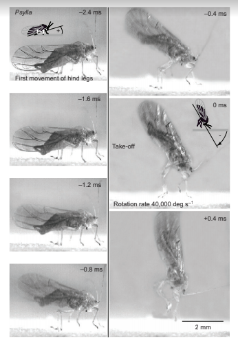

# Organisms with Ultra-Fast Biomechanics

Organisms that store and release elastic energy can achieve remarkably fast movements. This page contains examples of organisms that do this, and more information about each of them. 

To contribute to this page, choose an organism from the list below and add information to organisms.md in the [posmlab Github repository](https://github.com/posmlab/getting-started). Some starting references are provided as Google Drive links in each section. If you find other research papers, be sure to save them to the posmlab Google Drive "Papers" folder and link to them here. The organisms listed are from Table 1 of [Ilton et al Science 2018](https://drive.google.com/open?id=1uo5F2MfkcKfCjjJiLNwWVN3OzWN_OLh7), but add other examples here if you come across them.

-------------------

### List of Ultra-Fast Organisms
(Organism - Movement)

[Hydra - Nematocyst Discharge](#hydra)

[Fungi - Ballistospore ejection](#fungi)

[Bunchberry dogwood - Pollen ejection](#bunchberry-dogwood)

[Trap-jaw ant - Mandible strike](#trap-jaw-ant)

[Plant louse - Jump](#plant-louse) 

[Aquatic bladderworts - Suction trap](#aquatic-bladderworts)

[Froghopper - Jump](#froghopper)

[Venus fly trap - Snap buckling](#venus-fly-trap)

[Mantis shrimp - Appendage strike](#mantis-shrimp)

[Frog - Jump](#frog)

[Chameleon - Tongue projection](#chameleon)

[Locust - Jump](#locust)

-----------------

## Hydra
#### Nematocyst Discharge

Stinging cells (nematocytes) in jellyfish, sea anemone, and hydra (all from the phylum Cnidaria) discharge their contents at extremely fast rates.  For example, [this video of many nematocysts](https://www.youtube.com/watch?v=6zJiBc_N1Zk) discharging simultaneously or [this video of a single nematocyst](https://www.smithsonianmag.com/videos/category/science/nematocyst-discharge/) discharge show what the process looks like.

High speed imaging of Hydra from 
[Nüchter et al. Curr Biol 2006](https://drive.google.com/open?id=1CFU_P5xovp63FzKKlri6c5yTNwNzjeBO) show this discarge can occur in 700 nanoseconds, and the stylet (barbs) accelerate at 5 million g's of acceleration:

##### Part of Figure 1 from Nuchter et al. (A) Schematic of a nematocyst discharge. The stylet (black) is rapidly accelerated towards the prey (silver horizontal line). (B) Sequence of high speed images showing this process experimentally. The nematocst is roughly 10 um in diameter, and the time between each image is 500 ns. 

##### Summary of Kinematic Peformance from Nuchter et al

| Kinematic Metric | Hydra performance |
| -------- | ------- |
| Duration | 700 ns |
| Max. Velocity | 37 m/s |
| Max. Acceleration | 5.3 X $$10^7$$ m/s$$^2$$ | 

Wikipedia has a good description of nematocytes in the section on [Cnidocytes](https://en.wikipedia.org/wiki/Cnidaria#Cnidocytes). The possible mechanisms  for the rapid release of energy in this system are outlined in that section as well:

> + Rapid contraction of elastic collagen-like fibers in the walls of the capsule
> + The thread acts like a coiled spring that extends rapidly when released
> + Chemical changes in the capsule contents may cause them to expand rapidly by polymerization.
> + Chemical changes in the liquid in the capsule make it a much more concentrated solution, so that osmotic pressure forces water in very rapidly to dilute it.

 For further rearding, [Koch et al. J Cell Sci 1998](https://drive.google.com/open?id=1FDeOC1uCXSm3mZ_uhf2bb_3b2A58FMAT) has more details about the structure of the components of a nemacoyst. 

## Fungi
Ballistospore ejection

[Pringle et al. Mycologia 2005](https://drive.google.com/open?id=1l61XLYrZkQ6vT2PlwgRzD-ZIDDHwxxYm)

## Bunchberry dogwood
Pollen ejection

[Edwards et al Nature 2005](https://drive.google.com/open?id=1mhsZLLmR3mQ6wnW22S2vXWh6pQbb_hfK)   [Whitaker et al Funct Ecol 2007](https://drive.google.com/open?id=1aDwN8sZAc_1h2zxtPX4dvLuHWyw_RZUB)

## Trap-jaw ant
#### Mandible strike

The mandible strike of trap-jaw ants serve as methods to avoid or eject predators and capture prey. During a mandible strike, trap-jaw ants close their mandibles at incredible speeds over short durations in specific orientations and strike surfaces to fit their desired function (avoiding predators,... ). Their common propulsion behaviors are named "bouncer defense" and "escape jump." Bouncer defense is when trap-jaw ants strike at predators while propelling themselves away. Escape jumps, on the other hand, is when trap-jaw ants strike at a substrate and vertically propel themselves to escape predation.

##### Summary of Kinematic Peformance from Patek et al

| Kinematic Metric | Trap-Jaw Ant performance |
| -------- | ------- |
| Duration | 0.13 ms |
| Max. Velocity | 64.3 m/s |
| Max. Acceleration | $$10^5$$ X $$g$$ m/s$$^2$$ | 

 For further reading, [Patek et al PNAS 2006](https://drive.google.com/open?id=1vitWKvYV8MkGgrC_HdBtFfyfihexE0kF) has more details about the mechanisms of a trap-jaw ant's mandible strike. 

## Plant louse

#### Jump

Louse is singular for lice! This summary is about jumping plant lice (psyllidae), which [are a family of small plant-feeding insects that tend to be very host-specific.](https://en.wikipedia.org/wiki/Psyllidae)

[Here] (https://www.youtube.com/watch?v=0qpi9V0PFsI&t=40s) is a video of one such species walking around. Unfortunately, catching its jump with a normal camera is probably close to impossible, given how fast they jump. However, in [this paper,](https://drive.google.com/open?id=13JHzVvbg-OZJOg0LRv6u5-BCOK8px6Ir) researchers have used high-speed cameras to capture the following images of a specific species of plant lice" 

##### Images of a jump by Psylla alni, viewed from the side and capturedat 5000 Hz, each with an exposure time of 0.05 ms. The images are arranged in two columns, with the bottom left-hand corner of each image providing a constant reference point in this and in Figs 5, 7–9. The hind legs started to move at –2.4 ms, and the continuing depression of the hind trochantera raised the rear of the body so that the middle legs lost contact with the ground and the head pitched forwards. Once airborne, the body rotated rapidly in the pitch plane. The cartoons show how the angle of the body relative to the ground was measured when the head was pointing upwards (frame –2.4 ms) and then downwards (frame 0 ms).

##### Summary of Kinematic Peformance from Burrows

| Kinematic Metric | Lice performance |
| -------- | ------- |
| Duration | 0.9 - 1.7 ms |
| Max. Velocity | 1.1 - 2.7 m/s |
| Max. Acceleration | ~2 X $$10^3$$ m/s$$^2$$ | 

The mechanism for the rapid release of energy is known in detail. Generally, these lice jump similarly to other insects, with the exception that they have a distinct take-off position in which the head points downwards and the front supports the bug, similar to a person doing a hand-stand. 

For further rearding, [Burrows JEB 2012](https://drive.google.com/open?id=13JHzVvbg-OZJOg0LRv6u5-BCOK8px6Ir) has more details about the physics of plant lice jumps and the relevant anatomy. 

## Aquatic bladderworts
Suction trap

[Vincent et al RSPB 2011](https://drive.google.com/open?id=1SgE97uRu5DxZeXFkE-0ApP1m1lzzCHET)

## Froghopper
Jump

[Burrows JEB 2006](https://drive.google.com/open?id=1j83P4jAcKa1akytmNG4rzPhvCoZ2iOOA)

## Venus fly trap
#### Snap buckling

[Forterre et al Nature 2005](https://drive.google.com/open?id=18SA4m-iTxUsy19nOkHbWvtjY7VU2YxwH)

[Poppinga et al Beilstein J Nanotechnol 2016](https://www.ncbi.nlm.nih.gov/pmc/articles/PMC4902084/)

The rapid closure of venus fly traps is achieved using a method called snap buckling, where a system "snaps" from one stable state to another stable state. Here's a diagram that visualizes snap buckling.

For reference, here is a labeled diagram of the parts of a venus fly trap.

In the open state, the lobes of the venus fly trap are convex (when viewed from the inside), while in the closed state, the lobes are concave.

When the venus fly trap goes from the open state to the closed state, the lobes undergo snap buckling from convex to concave. Here's a [video](https://www.youtube.com/watch?v=nhVKVSkdedY) showing it close up.

The snap closure of venus fly traps usually occur in less than half of a second, though the snap time varies from about 0.2 to 0.8 seconds. Since venus fly traps are also found to grow underwater, researchers timed the closing of submerged venus fly traps, and found that the closing time underwater was not significantly different from the closing time on land.

Additionally, tests involving ink droplets in the water showed that there was no significant outflow of water upon closure, meaning that venus fly traps could effectively catch underwater organisms without failing due to water being forced out, though this has yet to be studied in depth.

## Mantis shrimp
[McHenry et al JEB 2016](https://drive.google.com/open?id=1Y5uxVJzTMgKkaeD1xNOcufjjhUctAL1x)

## Frog
[James & Wilson Physiol Biochem Zool 2008](https://drive.google.com/open?id=1BvS-jnoicHjvtprCz7V4ZLBa01cu542w)

## Chameleon
#### Ballistic Tongue Projection
Chameleons project their tongues up to 2 times their body length in order to capture prey. Especially in smaller species, their tongue projection has evolved in order to minimize energy loss and maximize the efficiency of the feeding apparatus. Variation in tongue length, body length, and most notably snout-vent length (distance between cloaca and where the jaw joins, the jaw symphysis), result in the variations in tongue mechanism function. 

##### Figure 2 from Anderson. (A) Peak projection distance, (B) Peak projection velocity, (C) Peak projection acceleration, (D) peak mass/specific power output with respect to snout-vent length. 

##### Summary of Kinematic Peformance from Anderson

The kinematic performance of the chameleon tongue mechanism varies between species, with smaller species demonstrating the shortest durations, and highest accelerations and power outputs. The max. velocity acheived is proportional between species. Data was scaled by SVL, or snout-vent length of the species. 

| Kinematic Metric | Chameleon Tongue Performance |
| -------- | ------- |
| Duration | 9.7 - 54.6 ms |
| Max. Velocity | 2.91 - 5.41 m/s |
| Max. Acceleration | 286 - 2,590 m/s$$^2$$ | 
| Max. Power Output | 1410 - 14040 W/kg |

For further reading, [Anderson et al J Morphol 2012](https://drive.google.com/open?id=1VKMf49Xl4_XlBKxAQmxxGHzvIq1m56-U) describes the differences in tongue projection between the species of chameleon. 

## Locust
[Bennet-Clark JEB 1975](https://drive.google.com/open?id=1upOETTQ-CMrtJNOhR4sjUZQq8G15k1pN)

