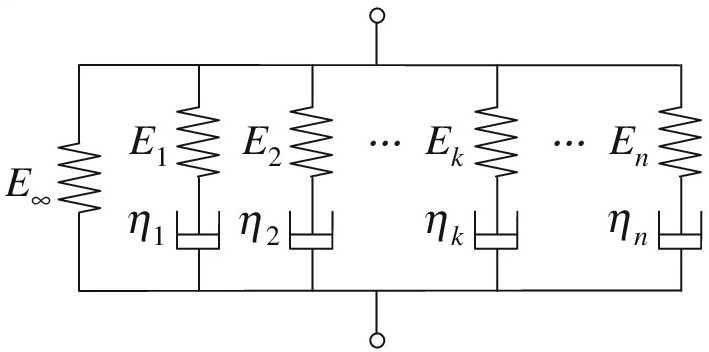
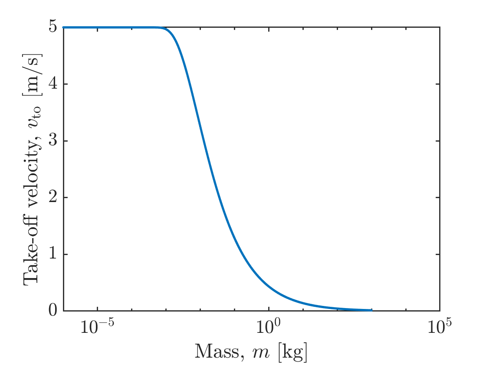

# Modeling Subgroup

This is the page about the Modeling Subgroup. Everything you want to know about how we predict the behvaior of materials using code.

## Motivation

How can we predict the motion of objects of known material? This is an obvious question, but one that gets increasingly interesting when we take "motion" to extremes such as high-speed or large deformation. Take the following slinky, and try to think through why it acts like that.

We can and should take inspiration from the actual physical process when choosing what approximations to take in our model. For example, it clearly takes time for the bottom of the slinky to realize that it's been dropped. If we were modeling this system, we should be sure to take an approach that encodes something like a "speed of information" in the material. In fact, this exact thought process underpins the analysis we've done.

The problem our modeling sets out to solve assumes that we've already characterized the material (see the [materials subgroup](../materials_subgroup/index.md) for more info on that). We then make informed decisions about which theoretical model we want to use to answer relevant questions, and implement that computationally. 

In practice, the characterization techniques are informed by the physical situation we wish to simulate and our choice of model. Oftentimes the actual research is an iterative process of characterizing, theory, and computation.

# Big Concepts

## LaMSA systems 

LaMSA (Latch-Mediated Spring Actuated) systems are one such model developed in part by Prof. Ilton. They help to model systems that can store lots of power and release that power quickly. Here's some steps you can take to learn more. (sorry I don't know more about this. Someone with more expertise update)

1) Read [Cook et al Integrartive Organismal Biology 2022](https://academic.oup.com/iob/article-pdf/4/1/obac032/45637152/obac032.pdf){:target="_blank"}. This paper presents the simplified LaMSA model that we are currently using in posmlab. Re-derive the equations of motion in the supplementary information at the end of that paper.

2) Download our [MATLAB LaMSA Template Model Software](https://posmlab.github.io/lamsa-template-model/){:target="_blank"}. Get the model to run on your computer, and start to play around with the components and parameters. Reproduce Figure 4A of [Ilton et al Science 2018](https://drive.google.com/drive/u/0/folders/1xL2xKtIF53JZkphJZ3PyK3RLj6TUwCBH){:target="_blank"} using the software.

3) Read more about [muscle modeling](MuscleModeling){:target="_blank"} to understand how muscle motors are implemented in the MATLAB LaMSA Model.
   
4) To understand how we use our MATLAB LaMSA Model to answer questions in biology, watch Prof. [Phil Anderson's 2022 SICB talk](https://drive.google.com/file/d/1Dj4MvMZeqiALX5iHjqrTwP3cui3K3rqP/view?usp=sharing){:target="_blank"}

## Springs and Dampers

A big concept in E79 - Intro Systems Engineering is modeling things as combinations of two objects: springs and dampers. Spring force is proportional to displacement from equilibrium $$F = -k \Delta x$$, and dampers apply a force proportional to velocity $$F = - b v$$. energy storage behavior is associated with springlike tendencies and energy loss is associated with damping behaviors. 

From a material modeling perspective, we'll be specifying local interactions and don't know the shape/size of our overall object. That is: we don't know the bulk parameters $$k$$ and $$b$$. We will have parameters which are normalized by length scale: a hardness $$E$$ and viscosity $$\eta$$. In order for units to make sense, we also use a stress $$\sigma$$ instead of force and strain $$\varepsilon$$ instead of displacement. For more information, see (reference).

<!-- (scaffold more? maybe a picture of the maxwell element?). -->

There are simple models combining these one of which is the maxwell element, which is just a spring and damper connected in series. This encodes some springlike behavior and some damping behavior. Our most powerful theoretical tool is the "Generalized Maxwell Model" which has as many maxwell elements as we want and one spring that dictates behavior if we stretch our material infinitely slowly. This is a powerful tool since each maxwell element corresponds to a different level of structure, and we can encode all of those different levels of structure at the same time.

<!-- maybe give more context or reference hierarchical structure earlier? -->

## Self-Guided Questions

1) Motor Model: Derive the take-off velocity for a mass $$m$$ that starts at rest and is driven by a motor that has a range of motion $$d$$ and a force-velocity trade-off 

$$F = F_{max}(1-v/v_{max})$$. 

Here $$F_{max}$$ and $$v_{max}$$ are the motor's maximum force and velocity, respectively. Do this for $$F_{max} = 20$$ N, $$v_{max} = 5$$ m/s, and $$d = 5$$ mm.
  

Hint 1

Start with Newton's second law $$m \frac{dv}{dt} = F_{max}(1-v/v_{max})$$

Hint 2 

You should end up with a transcendental equation, so you will need to use a numerical approach. 

Solution

See [motor-driven-motion.pdf](motor-driven-motion/motor-driven-motion.pdf){:target="_blank"} for a mathematical derivation and [motordrivenmotion.m](motor-driven-motion/motordrivenmotion.m){:target="_blank"} for an implementation of the numerial solution in MATLAB.

You should end up with a graph that looks like:

1) Spring Model: Derive the take-off velocity $$v_{to}$$ for a mass $$m$$ that starts at rest and is driven by a spring of stiffness $$k$$. The spring is loaded by the same motor as the one in the "Motor Model" above. As an added bonus, what are the maximum acceleration ($$a_{max}$$), launch duration ($$\Delta t$$) (sometimes referred to as take-off time $$t_{to}$$), and maximum power deliver to the mass ($$P_{max}$$). Remember $$P(t) = F(t)\,v(t) = m \,a(t)\, v(t)$$. 

2) How would the Spring Model change if the spring had a mass $$m_s$$? 

Hint

Consider the simplified case where the spring mass is much smaller than the load mass ($$m_s << m$$), so that the strain is uniform in the spring throughout the entire release. What is the velocity of each segment of the spring as a function of the velocity of the end of the spring? Conserve total energy (including kinetic energy from both the load mass and the spring mass) to get the take-off velocity

Answer

The answer is the same, but mass $$m$$ gets replaced by an effective mass $$m_{eff} = m + m_s/3$$. See [this note](images/Springmasscontribution.pdf) for a rough sketch of the argument. If you come up with a more fully explained solution, be sure to edit this document and add your contribution!

## More Resources

1) A good introduction to numerical methods in posmlab is Martin Gonzalez's 2021 [thesis](https://drive.google.com/file/d/1PBz2mY1wNVr84FQzkisqz3Q_GyFotCk9/view?usp=sharing){:target="_blank"}. In particular sections 2.1 - 3.2.

2) If you are working on larval mantis shrimp modeling, watch [Jacob Harrison's 2022 SICB talk](https://drive.google.com/file/d/1Dl48QgxQS8QxSCjXUHHZW-JSlU1x7Ezp/view?usp=sharing){:target="_blank"}

3) For an overview of current projects, see the [Summer 2022 Modeling directory](https://drive.google.com/drive/u/0/folders/1PvuxRRX3qj0vFsGm9evReVvs94iv2nY_){:target="_blank"} (outdated)

<!-- add another page that walks through simulate_experiment.m -->