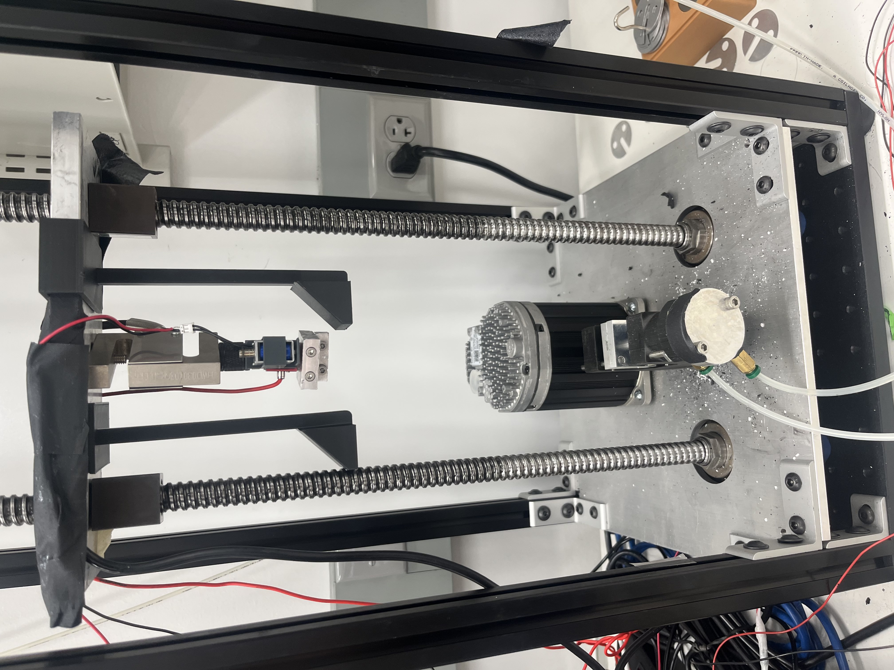

# Recoil Subgroup

This is the page about the Recoil Subgroup. Everything you want to know about ELLA and measuring high-speed elastic systems.

## Motivation

Fast moving systems are hard to measure. This is especially true for fast moving biological systems, which are often small (like on the cell level) or involve working with live animals. A very real approach to understand such systems is to run similar experiments on larger systems and scale down the results. We developed ELLA for exactly these experiments.

ELLA is a programmable translation stage/force sensor that allows us to measure force as a function of position and time. It is also equipped with a pneumatic clamp to quickly release a sample, letting it recoil. This recoiling is usually filmed with a slow-mo camera, so we can get even more detailed information about the recoil process. Combining slow-mo footage with measured force data into one coherent picture is a complex process, but it results in some awesome visuals.

# The Devil is in the Details

When it comes time to actually take data, there are a couple clear steps to take. They are listed abstractly below. If you want excruciating detail, here is a [link](https://docs.google.com/document/d/147oCsNJrbAPl2sZjDC3pIhCg4dQ4eqpxUtKVTgz7GvY/edit?tab=t.0#heading=h.pd9r4sm71ctv) to a 2025 Standard Operating Procedure (SOP) for our recoil experiments. 

## Sample Prep
This will vary depending on your research question, but historically posmlab has used rubbers from McMaster Carr to make our experiments more repeatable and standardized. These include polyurethane (PU), neoprene (CR), and natural rubber (NR). Within each material, we differentiate different compositions by their hardness as measured by a durometer. So the material for a certain trial would be specified as CR40A, meaning neoprene 40a hardness.

You'll need to measure the length, width, and thickness of a sample. This is best done with a caliper. Something unique to soft matter is that you can easily compress the sample while trying to measure it. There are two strategies to minimize this effect:

1. Try to find the smallest distance for the sample to slide freely between the caliper ends. This way we aren't measuring by compressing.

2. Ask a labmate to measure and see if you get the same thing. Taking many trials and finding the mean is tried and true.

You'll also likely add mass to the end of your sample to act as "added mass." After all, the mantis shrimp doesn't just have a powerful energy storage system, it has a fist to turn that into destructive power!

Ultimately, record parameters and measurements you make in some kind of lab notebook. Here's an example from [Summer 2025](https://docs.google.com/spreadsheets/d/1h8V4_KHzGjbwLkcfm_JsaiL7i9OmW5c00WFZbWA9sxg/edit). If you have questions, ask Prof. Ilton about research best practices, both for statistics and bookkeeping.

## Interfacing With ELLA

ELLA is programmable. This means you can give it instructions to execute your experiment. Matlab is still the language of choice, in particular Matlab apps. When  taking data, the graphical interface is quite convenient. You can enter commands in a text field in the top left, control the position of the translation stage manually, and see readouts of force and position.

(picture of ELLA GUI)

To look at the internals of a Matlab app, open matlab and click "app designer" in the top left. You should be able to open the (ella matlab app file name) and see what code is running in there. <b><u> we trust this code. please don't change it. </u></b>

## What Happens During an Experiment?

Once a sample is prepared, you load it into ELLA. To standardize viscoelastic conditions before data taking (and to account for the [Mullins effect](https://en.wikipedia.org/wiki/Mullins_effect)) we usually "warm up" the material by doing a couple cycles of stretching and unstretching. This has the added benefit of helping us understand the slow speed behaviors of our material. We end by stretching the material out to the desired strain for a recoil experiment, usually 1.5x-2x its rest length.

Once we have the sample stretched out, we release the bottom via ELLA's pneumatic clamp. The high-speed camera and force sensor work together to collect data during this process.

At the end of the experiment, ELLA's code will spit out a bunch of files. These contain information on the loading/unloading cycles, force data during recoil, and camera footage. Also included are files with experiment information (e.g. length, width, material, initial strain, added mass).

## Analyzing Experimental Data

We also analyze our data with a matlab app. Here is the github repo for that code. For a more granular overview of helpful functions see the [Software Reference](code_reference.md). Big picture, there are key goals of our analysis:

1. Synchronize the high-speed camera with our force sensor (have them agree on when time = 0)
2. Since the camera and force sample at different rates, we want to interpolate that data to have position and force data at the exact same moments. (maybe include a picture of a linear interpolation for this?)
3. Track relevant positions in the camera footage.
4. Have beautiful force and position data for use in whatever calculations you could want to do!

Oftentimes, there can be a lot of noise in the force and position data, so we do our best to find the underlying truth. Ask Prof. Ilton about Free-Knot Spline Fitting!

# Further Reading

1) Prof. Ilton's paper on [size scaling](https://pubs.rsc.org/en/content/articlehtml/2019/sm/c9sm00870e) gives good background on 

2) The standard operating procedure for running recoil experiments is linked [here](https://docs.google.com/document/d/147oCsNJrbAPl2sZjDC3pIhCg4dQ4eqpxUtKVTgz7GvY/edit?tab=t.0#heading=h.pd9r4sm71ctv).

3) There's that paper Prof. Ilton asked me to read that details a similar experimental setup? maybe include that here